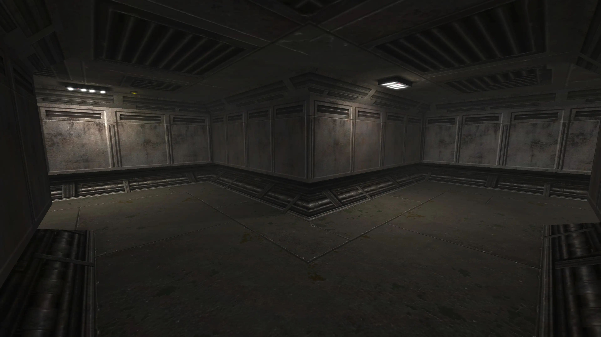

# Fortification - Game Level For Unvanquished
 

## Overview: Sci-Fi military base in the Sahara
Fortification is a game level by Matthias "Masmblr" Peters for the open source game [_Unvanquished_](https://Unvanquished.net/).

##  Description: 
   Welcome to "Fortification," an abandoned sci-fi military base in the vast expanse of the Sahara desert. Drawing inspiration from the layout of the popular map "fort5".

   The design of Fortification embraces the eerie and desolate ambiance of a once-thriving military facility, now left to the unforgiving desert sands. 
   Players will find themselves navigating through a axially symmetrical environment. At the core of Fortification lies a central battleground and shuttle landing area. 
   This open, mid-sized arena serves as the focal point of the map, where players will engage in fierce firefights and tactical skirmishes.

   One of the key highlights of Fortification is the dual-access system. Players can choose between two distinct paths to approach the central battleground.
   Delving deeper into the mysteries of the abandoned military base, players will discover an underground connection tunnel.

## Screenshots:

## History:
| Version: | Date:        | Status: |    
| ------- | ------------- | ------: | 
| 1.0    | 05/07/2015  | alpha |
| 1.1    | 30/08/2015  | beta |
| 1.15    | 13/08/2024  | beta |

 * * *

    Changelog:
    
    05.07.2015: v1.0
    -Initial release
    
    30.08.2015: v1.1
    -NavMeshes added
    -Geometry enhanced
    -Shader and gfx updates

    13.08.2024: v1.15
    -Shader and Texture enhancements
    -Various fixes
    -Source cleanup
    -Sounds exchanged
    -License updated

 * * *

## Development Tools:
[GIMP](https://www.gimp.org/) \
[Photoshop](https://www.adobe.com/de/products/photoshop.html) \
[Audacity](https://www.audacityteam.org/) \
[NetRadiant](https://netradiant.gitlab.io/) (v1.5.0-20220628) \
[Q3Map2](http://q3map2.robotrenegade.com/) \
[Notepad++](https://notepad-plus-plus.org/) \
[Visual Studio Code](https://code.visualstudio.com/)

## Thanks to:
* id Software for Quake3
* Team Xonotic for NetRadiant 
* Unvanquished Development for Unvanquished

## Related Resources:
Unvanquished website: https://unvanquished.net \
NetRadiant Level-Editor: https://netradiant.gitlab.io \
Unvanquished-Mapping Wiki: https://wiki.unvanquished.net/wiki/Mapping \
Quake3 Shader Manual: http://toolz.nexuizninjaz.com/shader/ \
Quake3 advanced Map-Compiler: http://q3map2.robotrenegade.com \
Excellent source of various sounds: https://freesound.org

## Credits - Legal Information and Attribution
Below is a list of files along with their legal statuses. For detailed license information,
please refer to the LICENSE file or the provided link. Works that incorporate elements
influenced by other pieces are indicated with an asterisk (*) at the end, followed by the original author.

The following files are published by Matthias “Masmblr” Peters (masmblr@gmail.com)
under the CC BY 4.0 - Attribution 4.0 International license:

DEPS \
LICENSE \
README.md \
VERSION \
about\fortification.txt
env/fortification/desert_bk.webp * ([Szico VII](www.szicovii.com), Attribution-ShareAlike) \
env/fortification/desert_dn.webp * ([Szico VII](www.szicovii.com), Attribution-ShareAlike) \
env/fortification/desert_ft.webp * ([Szico VII](www.szicovii.com), Attribution-ShareAlike) \
env/fortification/desert_lf.webp * ([Szico VII](www.szicovii.com), Attribution-ShareAlike) \
env/fortification/desert_rt.webp * ([Szico VII](www.szicovii.com), Attribution-ShareAlike) \
env/fortification/desert_up.webp * ([Szico VII](www.szicovii.com), Attribution-ShareAlike) \
gfx/fortification/colorgrading.webp * (https://www.unvanquished.net), GNU GPLv3, CC BY-SA 2.5) \
maps/fortification.map \
meta/fortification/fortification.arena \
meta/fortification/fortification.webp \
minimaps/fortification.webp \
readme_meta/header/header.webp \
preview_levelshots/1.webp \
preview_levelshots/2.webp \
preview_levelshots/3.webp \
preview_levelshots/4.webp \
preview_levelshots/5.webp \
preview_levelshots/6.webp \
preview_levelshots/7.webp \
preview_levelshots/8.webp \
preview_levelshots/9.webp \
preview_levelshots/10.webp \
preview_levelshots/11.webp \
preview_levelshots/12.webp \
scripts/fortification_custom.particle \
scripts/fortification_custom.shader \
scripts/shaderlist.txt \
sounds/fortification/fortification_amb.opus * ([inchadney](https://freesound.org/people/inchadney), Attribution-ShareAlike 4.0) \
sounds/fortification/pump_start.opus * ([Jorge_M_Rodrigues](https://freesound.org/people/Jorge_M_Rodrigues/), Attribution NonCommercial 4.0) \
sounds/fortification/pump_end.opus * ([Jorge_M_Rodrigues](https://freesound.org/people/Jorge_M_Rodrigues/), Attribution NonCommercial 4.0) \
textures/fortification_custom_src/crate_01_d.webp * (Milosh Andrich, Attribution License) \
textures/fortification_custom_src/crate_01_n.webp * (Milosh Andrich, Attribution License) \
textures/fortification_custom_src/crate_01_s.webp * (Milosh Andrich, Attribution License) \
textures/fortification_custom_src/crate_02_d.webp * (Milosh Andrich, Attribution License) \
textures/fortification_custom_src/crate_02_n.webp * (Milosh Andrich, Attribution License) \
textures/fortification_custom_src/crate_02_s.webp * (Milosh Andrich, Attribution License) \
textures/fortification_custom_src/env\fortification\ecal_01.webp \
textures/fortification_custom_src/env\fortification\oor_01_d.webp * (Milosh Andrich, Attribution License) \
textures/fortification_custom_src/env\fortification\oor_01_n.webp * (Milosh Andrich, Attribution License) \
textures/fortification_custom_src/env\fortification\oor_01_s.webp * (Milosh Andrich, Attribution License) \
textures/fortification_custom_src/env\fortification\oor_02_d.webp * (Milosh Andrich, Attribution License) \
textures/fortification_custom_src/env\fortification\oor_02_n.webp * (Milosh Andrich, Attribution License) \
textures/fortification_custom_src/env\fortification\oor_02_s.webp * (Milosh Andrich, Attribution License) \
textures/fortification_custom_src/env\fortification\ust_01_d.webp * (Milosh Andrich, Attribution License) \
textures/fortification_custom_src/floor_01b_d.webp * (Milosh Andrich, Attribution License) \
textures/fortification_custom_src/floor_01_d.webp * (Milosh Andrich, Attribution License) \
textures/fortification_custom_src/floor_01_n.webp * (Milosh Andrich, Attribution License) \
textures/fortification_custom_src/floor_01_s.webp * (Milosh Andrich, Attribution License) \
textures/fortification_custom_src/floor_02_d.webp * (Milosh Andrich, Attribution License) \
textures/fortification_custom_src/floor_02_n.webp * (Milosh Andrich, Attribution License) \
textures/fortification_custom_src/floor_02_s.webp * (Milosh Andrich, Attribution License) \
textures/fortification_custom_src/floor_03_d.webp * (Milosh Andrich, Attribution License) \
textures/fortification_custom_src/floor_03_n.webp * (Milosh Andrich, Attribution License) \
textures/fortification_custom_src/floor_03_s.webp * (Milosh Andrich, Attribution License) \
textures/fortification_custom_src/floor_04b_d.webp * (Milosh Andrich, Attribution License) \
textures/fortification_custom_src/floor_04ter_d.webp * (Milosh Andrich, Attribution License) \
textures/fortification_custom_src/floor_04_d.webp * (Milosh Andrich, Attribution License) \
textures/fortification_custom_src/floor_04_n.webp * (Milosh Andrich, Attribution License) \
textures/fortification_custom_src/floor_04_s.webp * (Milosh Andrich, Attribution License) \
textures/fortification_custom_src/floor_04_ter_blend.webp * (Milosh Andrich, Attribution License) \
textures/fortification_custom_src/floor_05_d.webp \
textures/fortification_custom_src/floor_05_n.webp \
textures/fortification_custom_src/floor_05_s.webp \
textures/fortification_custom_src/floor_06_d.webp * (Milosh Andrich, Attribution License) \
textures/fortification_custom_src/floor_06_n.webp * (Milosh Andrich, Attribution License) \
textures/fortification_custom_src/floor_06_s.webp * (Milosh Andrich, Attribution License) \
textures/fortification_custom_src/floor_07_d.webp * (Milosh Andrich, Attribution License) \
textures/fortification_custom_src/floor_07_n.webp * (Milosh Andrich, Attribution License) \
textures/fortification_custom_src/floor_07_s.webp * (Milosh Andrich, Attribution License) \
textures/fortification_custom_src/floor_08_d.webp * (Milosh Andrich, Attribution License) \
textures/fortification_custom_src/floor_08_n.webp * (Milosh Andrich, Attribution License) \
textures/fortification_custom_src/floor_08_s.webp * (Milosh Andrich, Attribution License) \
textures/fortification_custom_src/func_01_blink.webp * (Milosh Andrich, Attribution License) \
textures/fortification_custom_src/func_01_d.webp * (Milosh Andrich, Attribution License) \
textures/fortification_custom_src/func_01_glow.webp * (Milosh Andrich, Attribution License) \
textures/fortification_custom_src/func_01_n.webp * (Milosh Andrich, Attribution License) \
textures/fortification_custom_src/func_01_s.webp * (Milosh Andrich, Attribution License) \
textures/fortification_custom_src/glass_01_d.webp \
textures/fortification_custom_src/glass_01_hhm.webp \
textures/fortification_custom_src/glass_01_n.webp \
textures/fortification_custom_src/glass_01_s.webp \
textures/fortification_custom_src/light_01_blink.webp \
textures/fortification_custom_src/light_01_d.webp * (Milosh Andrich, Attribution License) \
textures/fortification_custom_src/light_01_glow.webp * (Milosh Andrich, Attribution License) \
textures/fortification_custom_src/light_01_n.webp * (Milosh Andrich, Attribution License) \
textures/fortification_custom_src/light_01_s.webp * (Milosh Andrich, Attribution License) \
textures/fortification_custom_src/light_02_d.webp * (Milosh Andrich, Attribution License) \
textures/fortification_custom_src/light_02_glow.webp * (Milosh Andrich, Attribution License) \
textures/fortification_custom_src/light_02_n.webp * (Milosh Andrich, Attribution License) \
textures/fortification_custom_src/light_02_s.webp * (Milosh Andrich, Attribution License) \
textures/fortification_custom_src/light_03_d.webp * (Milosh Andrich, Attribution License) \
textures/fortification_custom_src/light_03_glow.webp * (Milosh Andrich, Attribution License) \
textures/fortification_custom_src/light_03_n.webp * (Milosh Andrich, Attribution License) \
textures/fortification_custom_src/light_03_s.webp * (Milosh Andrich, Attribution License) \
textures/fortification_custom_src/nature_01b_d.webp \
textures/fortification_custom_src/nature_01_d.webp \
textures/fortification_custom_src/nature_01_n.webp \
textures/fortification_custom_src/nature_01_s.webp \
textures/fortification_custom_src/nature_02b_d.webp * ([Szico VII](www.szicovii.com), Attribution-ShareAlike) \
textures/fortification_custom_src/nature_02ter_d.webp * ([Szico VII](www.szicovii.com), Attribution-ShareAlike) \
textures/fortification_custom_src/nature_02_d.webp * ([Szico VII](www.szicovii.com), Attribution-ShareAlike) \
textures/fortification_custom_src/nature_02_n.webp * ([Szico VII](www.szicovii.com), Attribution-ShareAlike) \
textures/fortification_custom_src/nature_02_s.webp * ([Szico VII](www.szicovii.com), Attribution-ShareAlike) \
textures/fortification_custom_src/null.webp \
textures/fortification_custom_src/sand_drift.webp \
textures/fortification_custom_src/sfx_01.webp \
textures/fortification_custom_src/sfx_02.webp \
textures/fortification_custom_src/sfx_envmap.webp \
textures/fortification_custom_src/top_01b_d.webp * (Milosh Andrich, Attribution License) \
textures/fortification_custom_src/top_01b_n.webp * (Milosh Andrich, Attribution License) \
textures/fortification_custom_src/top_01b_s.webp * (Milosh Andrich, Attribution License) \
textures/fortification_custom_src/top_01_d.webp * (Milosh Andrich, Attribution License) \
textures/fortification_custom_src/trim_01_d.webp * (Milosh Andrich, Attribution License) \
textures/fortification_custom_src/trim_01_n.webp * (Milosh Andrich, Attribution License) \
textures/fortification_custom_src/trim_01_s.webp * (Milosh Andrich, Attribution License) \
textures/fortification_custom_src/trim_02_d.webp * (Milosh Andrich, Attribution License) \
textures/fortification_custom_src/trim_02_n.webp * (Milosh Andrich, Attribution License) \
textures/fortification_custom_src/trim_02_s.webp * (Milosh Andrich, Attribution License) \
textures/fortification_custom_src/trim_03_d.webp * (Milosh Andrich, Attribution License) \
textures/fortification_custom_src/trim_03_n.webp * (Milosh Andrich, Attribution License) \
textures/fortification_custom_src/trim_03_s.webp * (Milosh Andrich, Attribution License) \
textures/fortification_custom_src/trim_04_d.webp * (Milosh Andrich, Attribution License) \
textures/fortification_custom_src/trim_04_n.webp * (Milosh Andrich, Attribution License) \
textures/fortification_custom_src/trim_04_s.webp * (Milosh Andrich, Attribution License) \
textures/fortification_custom_src/wall_01_d.webp * (Milosh Andrich, Attribution License) \
textures/fortification_custom_src/wall_01_n.webp * (Milosh Andrich, Attribution License) \
textures/fortification_custom_src/wall_01_s.webp * (Milosh Andrich, Attribution License) \
textures/fortification_custom_src/wall_03_d.webp * (Milosh Andrich, Attribution License) \
textures/fortification_custom_src/wall_03_n.webp * (Milosh Andrich, Attribution License) \
textures/fortification_custom_src/wall_03_s.webp * (Milosh Andrich, Attribution License) \
textures/fortification_custom_src/wall_04_d.webp * (Milosh Andrich, Attribution License) \
textures/fortification_custom_src/wall_04_n.webp * (Milosh Andrich, Attribution License) \
textures/fortification_custom_src/wall_04_s.webp * (Milosh Andrich, Attribution License) \
textures/fortification_custom_src/wall_05_d.webp * (Milosh Andrich, Attribution License) \
textures/fortification_custom_src/wall_05_n.webp * (Milosh Andrich, Attribution License) \
textures/fortification_custom_src/wall_05_s.webp * (Milosh Andrich, Attribution License) \
textures/fortification_custom_src/wall_06_d.webp * (Milosh Andrich, Attribution License) \
textures/fortification_custom_src/wall_06_n.webp * (Milosh Andrich, Attribution License) \
textures/fortification_custom_src/wall_06_s.webp * (Milosh Andrich, Attribution License) \
textures/fortification_custom_src/wall_07_d.webp * (Milosh Andrich, Attribution License) \
textures/fortification_custom_src/wall_07_n.webp * (Milosh Andrich, Attribution License) \
textures/fortification_custom_src/wall_07_s.webp * (Milosh Andrich, Attribution License) \
textures/fortification_custom_src/wall_07_sand_d.webp * (Milosh Andrich, Attribution License) \
textures/fortification_custom_src/wall_08_d.webp * (Milosh Andrich, Attribution License) \
textures/fortification_custom_src/wall_08_n.webp * (Milosh Andrich, Attribution License) \
textures/fortification_custom_src/wall_08_s.webp * (Milosh Andrich, Attribution License) \
textures/fortification_custom_src/weather.webp \
textures/fortification_custom_src/qer_related/desert_light_img.webp \
textures/fortification_custom_src/qer_related/dessert_fog.webp \
textures/fortification_custom_src/qer_related/qer_alphablend_0.webp \
textures/fortification_custom_src/qer_related/qer_alphablend_1.webp
